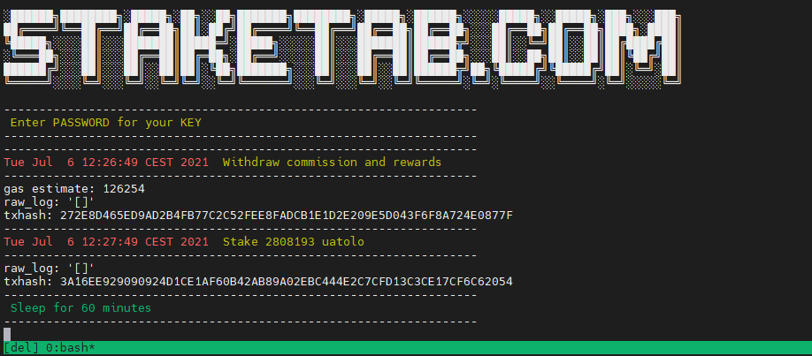

# COSMOS Tools
List of tools for COSMOS projects.

# COSMOVISOR
Setup COSMOVISOR for all Cosmos projects.  

### 1. GOLANG #GO
Install custom version of Golang #GO.  
Specify version in this line `./install.sh -v VERSION`  
Example `./install.sh -v 1.15.7`    

Or you can install GO from [official website](https://golang.org/doc/install).
```
wget https://raw.githubusercontent.com/Staketab/node-tools/main/components/golang/install.sh \
&& chmod +x install.sh \
&& ./install.sh -v 1.15.7
```
Reboot your terminal after installing.

### 2. Run COSMOVISOR setup and build.
Enter Enviroments `COSMOVISOR_VER GIT_NAME GIT_FOLDER BIN_NAME CONFIG_FOLDER BIN_VER` and run this script to setup and build.  
```
wget https://raw.githubusercontent.com/Staketab/cosmos-tools/main/cosmovisor/cosmovisor.sh \
&& chmod +x cosmovisor.sh \
&& ./cosmovisor.sh COSMOVISOR_VER GIT_NAME GIT_FOLDER BIN_NAME CONFIG_FOLDER BIN_VER
```
#### On the example of the Desmos project:  
`COSMOVISOR_VER = v0.42.6`  
`GIT_NAME = desmos-labs`  
`GIT_FOLDER = desmos`  
`BIN_NAME = desmos`  
`CONFIG_FOLDER = desmos`   
`BIN_VER = v0.16.0`

The run command should look like this:  
```
wget https://raw.githubusercontent.com/Staketab/cosmos-tools/main/cosmovisor/cosmovisor.sh \
&& chmod +x cosmovisor.sh \
&& ./cosmovisor.sh v0.42.4 desmos-labs desmos desmos desmos v0.16.0
```
# AUTO WITHDRAW AND DELEGATE SCRIPT.
Install script for auto-withdraw-delegate rewards to your Validator every 60 minutes.  
Specify environments in this line `./start.sh BINARY KEY_NAME`  
Example `./start.sh rizond keyname`  

## If you have custom `RPC PORT` specify his at the end of line`./start.sh BINARY KEY_NAME RPC_PORT`  

Start new `TMUX` session:
```
tmux new -s delegate
```
And start this script:
```
wget https://raw.githubusercontent.com/Staketab/cosmos-tools/main/auto-withdraw-delegate/start.sh \
&& chmod +x start.sh \
&& ./start.sh rizond keyname rpc_port
```
## SCREENSHOT EXAMPLE: 


### DONE
