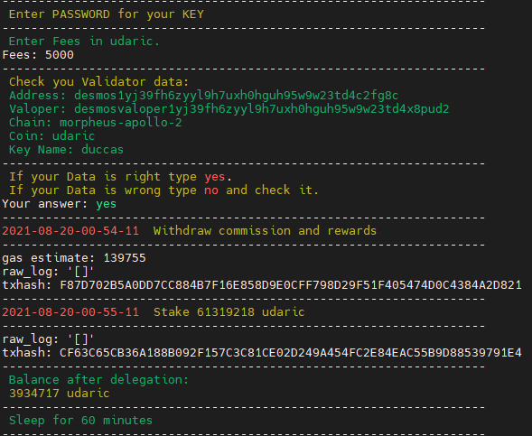
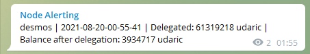

# AUTO WITHDRAW AND DELEGATE SCRIPT.
Install script for auto-withdraw-delegate rewards to your Validator every 60 minutes.  
### Features:  
- You can specify a custom RPC port
- Custom FEES
- Custom Sleep Time in minutes
- Send message about delegation to Telegram
- It is enough to enter in the variables only the password, binary and key name in the start command
- No need to edit config

Specify environments in this line `./start.sh -b BINARY -k KEY_NAME -s SLEEP_TIME -p RPC_PORT -t TG_TOKEN -c TG_CHANNEL`  
Example `./start.sh -b desmos -k ducca -s 60m -p 36657 -t 1948967210:ATrsFGHJEpdYPO81S13nzn56FgcE_YA-t_S -c -1542578945875`  
`-s 60m` - value in seconds(s), minutes(m), hours(h)  
### You can use like all variables, some or set only `-b BINARY` and `-k KEY_NAME`.

Start new `TMUX` session:
```
tmux new -s delegate
```
And start this script:
```
wget https://raw.githubusercontent.com/Staketab/cosmos-tools/main/auto-withdraw-delegate/start.sh \
&& chmod +x start.sh \
&& ./start.sh -b BINARY -k KEY_NAME -s SLEEP_TIME -p RPC_PORT -t TG_TOKEN -c TG_CHANNEL
```
## SCREENSHOT EXAMPLE: 
## `Tmux screen:`  


## `Telegram screen:`  

