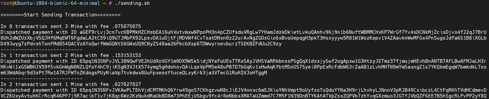

# Mina Transaction Automation

Automatic sending of transactions on the [Mina Protocol](https://minaprotocol.com/)

### Important!

Before using this script, you must have imported `coda accounts import -privkey-path $KEYPATH` and unlocked `coda accounts unlock -public-key $MINA_KEY` keys.

## Download the start.sh file from the repository to your server where Mina's node is installed and take the following steps:

Download:
```wget https://raw.githubusercontent.com/icohigh/mina-transactions-automation/main/start.sh```

Change data:
```nano $HOME/start.sh```

### 1. Set the number of transactions to send: 

```for ((i = 0 ; i < 100 ; i++));```

Where 100 is the number of transactions;

### 2.  Set the range of Mina tokens sent:

```amount=$(( $RANDOM %100 ))```
```amount=$( bc <<< "scale=9;$amount/333" )```

Where `100/333=0.3` - range is from 0 to 0.3 tokens;

### 3.  Set receiver and sender addresses:

```senderaddr="B62qpSphT9prqYrJFio82WmV3u29DkbzGprLAM3pZQM2ZEaiiBmyY82"```
```receiveraddr="B62qqtwygyMDh56idVbEAWRzaJCMFg3EXBnUcohZbBemaH6W2HmmG3b"```


## Preparing to launch

1. Set read permissions `chmod 700 $HOME/start.sh`
2. Run the script `$HOME/start.sh`

Done

