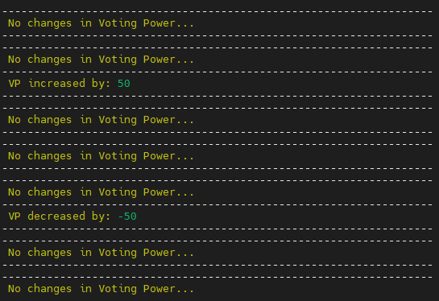

# VOTING POWER CHECKER SCRIPT.
Install VP checker script for your Validator.  

### Features:  
- You can specify a custom RPC port
- Custom Sleep Time in seconds(s), minutes(m), hours(h)
- Send message about delegation to Telegram and Discord
- No need to edit config

Specify environments in this line `./vp_checker.sh -b BINARY -s SLEEP_TIME -p RPC_PORT -t TG_TOKEN -c TG_CHANNEL -d DISCORD_HOOK`  
Example `./vp_checker.sh -b starsd -s 10s -p 36657 -t 1948967210:ATrsFGHJEpdYPO81S13nzn56FgcE_YA-t_S -c -1542578945875 -d https://discord.com/api/webhooks/4558...`  
`-s 10s` - value in seconds(s), minutes(m), hours(h)  
### You can use like all variables, some or set only `-b BINARY`.

Start new `TMUX` session:
```
tmux new -s checkvp
```
And start this script:
```
wget https://raw.githubusercontent.com/Staketab/cosmos-tools/main/vp_checker/vp_checker.sh \
&& chmod +x vp_checker.sh \
&& ./vp_checker.sh -b BINARY -s SLEEP_TIME -p RPC_PORT -t TG_TOKEN -c TG_CHANNEL -d DISCORD_HOOK
```
## SCREENSHOT EXAMPLE: 
## `Tmux screen:`  


## `Telegram screen:`  


## `Discord screen:`  

